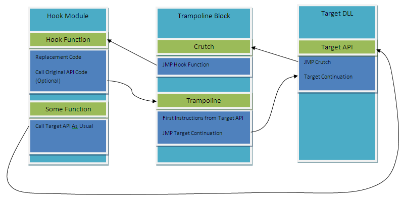

 mhook version 2.3

A Windows API hooking library

作者：[martona](https://github.com/martona/mhook)

---

mhook支持x86和x64位。就两个接口，使用非常简单。

BOOL Mhook_SetHook(PVOID *ppSystemFunction, PVOID pHookFunction);

BOOL Mhook_Unhook(PVOID *ppHookedFunction);

支持hook多线程。

disasm-lib为反汇编引擎。

---

##mhook 如何处理64为inlineHook

以MessageBoxA为例子：

MessageBoxA(NULL, "Msg", "Tip", MB_OK);

000000013F8D2699 45 33 C9             xor         r9d,r9d  

000000013F8D269C 4C 8D 05 F9 47 0B 00 lea         r8,[__xt_z+16Ch (013F986E9Ch)] 
 
000000013F8D26A3 48 8D 15 12 48 0B 00 lea         rdx,[__xt_z+18Ch (013F986EBCh)]
  
000000013F8D26AA 33 C9                xor         ecx,ecx  

000000013F8D26AC FF 15 EE BD 11 00    call        qword ptr [__imp_MessageBoxA (013F9EE4A0h)]  

---

一级跳 段内跳转

MessageBoxA:

00000000774912B8 E9 5B ED F7 FF       jmp         0000000077410018  

00000000774912BD 33 DB                xor         ebx,ebx  

00000000774912BF 44 39 1D 76 0E 02 00 cmp         dword ptr [gfEMIEnable (0774B213Ch)],r11d  

---

二级跳 段间跳转

0000000077410018 FF 25 00 00 00 00    jmp         qword ptr [7741001Eh]  

000000007741001E D0 25 8D 3F 01 00    shl         byte ptr [RegisterDeviceNotificationWorker+0FFFFCFA1h (077423FB1h)],1  

---

### 0x0000000077410000何时分配的？

TrampolineAlloc()

{

	BlockAlloc 查询内存

	寻找内存块，属性为mbi.State == MEM_FREE，大小为0x10000

	VirtualQuery(pbAlloc, &mbi, sizeof(mbi)

	找到后分配内存

	VirtualAlloc(pbAlloc, cAllocSize, MEM_COMMIT|MEM_RESERVE, PAGE_EXECUTE_READWRITE);

}

分配好的内存就是0x0000000077410000了，

这个地址的头保存一个结构体MHOOKS_TRAMPOLINE。

mhooks: BlockAlloc: Looking at address 0000000077490000

mhooks: BlockAlloc: Looking at address 0000000077480000

mhooks: BlockAlloc: Looking at address 00000000774A0000

。。。。

mhooks: BlockAlloc: Allocated block at 0000000077410000 as 481 trampolines

---
原理图

图片引用的，地址没记住。

